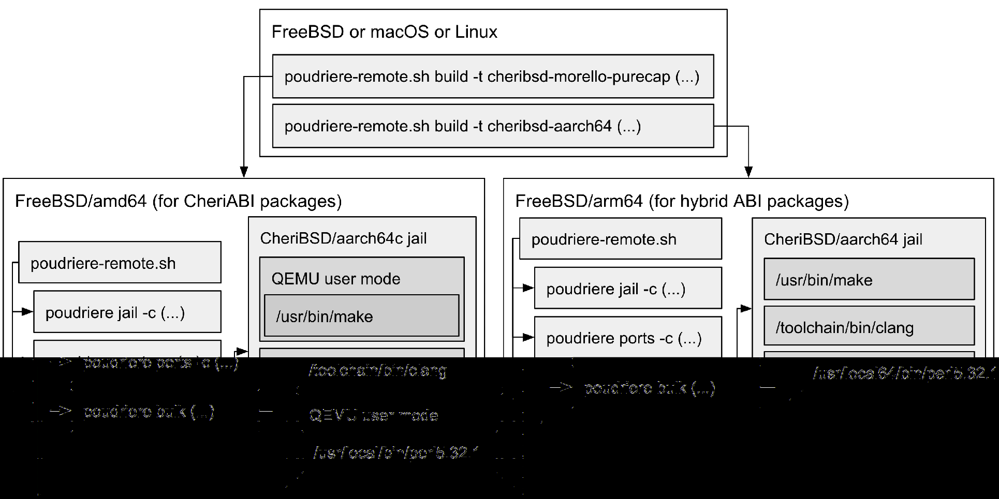

# CheriBSD port 和软件包——用于 Arm Morello 和 CHERI-RISC-V CheriBSD 的纯能力第三方软件

 - 原文：[CheriBSD Ports and Packages](https://freebsdfoundation.org/wp-content/uploads/2023/05/CheriBSD_ports.pdf)
 - 作者：Konrad Witaszczyk
 - 译者：冰
 - 校对整理：ykla

CHERI 是一个硬件/软件/语义学联合设计项目，旨在提高现有和未来硬件-软件堆栈实现的安全性。来自谷歌和微软的最新研究表明，他们产品中大约 70% 的漏洞与内存安全问题有关。CHERI 不仅使我们能够阻止大多数这类漏洞被利用，而且还能对软件进行分离，从而限制目前软件维护者不知道的可成功利用的漏洞的影响（例如，第三方软件依赖中的后门）。

随着 Arm Morello 平台的发布，CHERI 的生态系统迅速扩大。

直到 2022 年，CHERI 项目主要由剑桥大学、SRI 国际和他们的合作伙伴开发，包括微软、谷歌和 Arm。随着 Arm Morello 平台的发布，CHERI 生态系统迅速扩大，这是 CHERI 第一个面向大众的硬件实现。2022 年 1 月，Arm 开始向公司、学术和政府机构运送第一批（大约一千块）Morello 开发板。为了给 Morello 用户提供一个用户友好的工作环境，*CheriBSD*——一个基于 FreeBSD 的操作系统，适配 Arm Morello 和 CHERIRISC-V ——他们需要一个基础工具，在 Morello 发布之前构建和分发兼容 CHERI 的第三方软件。今天，有几十所大学、政府研究实验室和公司在 Morello 的工作中使用 CheriBSD，并且每天都依赖这个基本系统。

这篇文章介绍了我们在没有 CHERI 的硬件支持情况下，使用 QEMU 用户模式、FreeBSD ports 和 Poudriere 为 CheriBSD 构建第三方软件包的历程。在讨论软件包构建基础设施的实施细节的同时，文章总结了我们需要做哪些决定和改变，以最终实现约 24,000 个 AArch64 软件包和约 9,000 个支持 CHERI 的软件包。

## CHERI 硬件-软件栈

为了充分了解 CheriBSD 软件包构建的基础设施，我们应该首先介绍开发者可以用来构建 CHERI 软件的 SDK。CHERI 硬件-软件堆栈（见表 1）由硬件、仿真器、编译器、调试器、操作系统和支持 CHERI 的操作系统的应用程序组成。这个堆栈的每个组件都需要为 CHERI 进行调整，并且必须实现对 CHERI 能力的支持。

| 第三方软件 | 约 9,000 个 CHERI 软件包 (Morello)<br/><br/> 约 24,000 个非 CHERI 软件包 (Morello)                                                          |
|:-----:| -------------------------------------------------------------------------------------------------------------------------------------- |
| 操作系统  | CheriBSD (Morello, CHERI-RISC-V)<br/>FreeRTOS (CHERI-RISC-V)<br/>CHERIoT RTOS (CHERI-RISC-V)<br/>Linux (Morello)<br/>Android (Morello) |
| 工具链   | CHERI LLVM for CHERI C/C++ (Morello, CHERI-RISC-V)<br/>Morello GCC for CHERI C/C++ (Morello)<br/>GDB-CHERI (Morello, CHERI-RISC-V)     |
| CPU   | Arm Morello SoC<br/>CHERI-RISC-V on FPGA<br/>QEMU-CHERI (Morello, CHERI-RISC-V)<br/>Microsoft CHERIoT (CHERI-RISC-V)                   |

**表 1：目前的 CHERI 硬件-软件栈**

在 Arm Morello 平台【注20】发布之前，CheriBSD 和第三方软件已经使用 Morello 和 CHERI-RISC-V【注9】的 QEMU 仿真器进行开发和移植了。这个环境在今天仍然很有用，可以在多个 CheriBSD 分支上工作，或者将 GDB 调试器连接到 QEMU 上，并在 CheriBSD 内核中逐步进行。任何对我们的研究感兴趣的人都可以尝试 CHERI 练习【注25】，在 QEMU 下探索 CHERI 如何防止产生内存安全问题。可以通过 *cheribuild* 工具【注1】在 FreeBSD、Linux 和 macOS 上创建一个基于 Morello QEMU 的虚拟机，使用一个简单的命令来获取和编译所需的软件，并运行该虚拟机：

```
$ ./cheribuild.py --include-dependencies run-morello-purecap
```

可用的工具链包括 LLVM 编译器【注14、17】和 GDB 调试器【注15】。LLVM 可以交叉编译代码或在硬件上/QEMU 下进行本地编译。GDB-CHERI，目前基于 GDB 12，可以反汇编能力感知的指令，并打印寄存器和内存中的能力信息。虽然本文主要讨论 CheriBSD【注3】，但 Arm 也开发了 Linux 和 Android 操作系统【注18】，并为 Morello【注19】提供了 CHERI LLVM 和 GCC 编译器。2023 年 2 月，微软也发布了 CHERIoT 项目【注16】，该项目为嵌入式 RISC-V 设备实现了一个完整的硬件-软件堆栈与 CHERIoT RTOS。

有了上述的 SDK，我们决定复刻 FreeBSD ports，并对其进行错误修正，以及对 CHERI 和 CheriBSD 的必要修改。我们把这个 ports 称为 *CheriBSD ports*。

移植软件到 CHERI 的过程类似于将为 32 位架构开发的代码移植到 64 位架构。一个纯能力的程序只能使用 CHERI 能力和 CHERI 感知的 CPU 指令来访问内存。在这样的程序中，一个指针的大小增加到 128 位，以容纳 CHERI 能力。为了编译 C/C++ 程序，代码必须兼容 CHERI C/C++ 语义【注24】，要求使用适当的数据类型来存储指针（例如，uintptr_t 而不是 long），并将指针的对齐方式增加到 16 字节。CHERI LLVM 可以识别 C/C++ 和 CHERI/C++ 之间的许多不兼容之处，并显示详细的警告，建议对代码进行哪些修改以使其与 CHERI 兼容。在许多情况下，开发者在修复了 CHERI LLVM 发现的所有问题后，就可以成功编译和运行他们的软件。然而，建议进行广泛的测试，以确保移植的软件不包括任何运行时的错误（例如，自定义内存分配器的错位分配）。

虽然很多开源项目已经被移植到 CHERI，但很多关键的应用程序仍然不能被编译为使用 CHERI 的功能。例如，网络浏览器是非常复杂的软件，有大量的依赖关系。

与现有软件的兼容性对于 CHERI 项目来说是非常重要的，它可以使软件逐步适应 CHERI。

为了提供一个全功能的开发平台, CheriBSD 允许运行适应 CHERI 的应用程序和为 CHERI 扩展的 CPU（例如，Morello 的 Armv8-A）基线架构编译的应用程序。与现有软件的兼容性对于 CHERI 项目来说是至关重要的，它允许为 CHERI 逐步调整软件，而不是要求从头开始重新开发一个应用程序。FreeBSD，作为 CheriBSD 的基础操作系统，能够实现传统软件和 CHERI 感知软件的运行时环境。然而，当涉及到为多个运行时环境提供第三方软件时，CheriBSD 仍然有一些从 FreeBSD 继承的挑战。


## 多 ABI 支持

FreeBSD 有一个被称为兼容层的功能，它为针对不同 ABI 编译的程序提供系统调用的实现，而非针对本地 ABI。例如，amd64 的 FreeBSD 内核带有一个编译的 32 位兼容层（也被称为 *freebsd32*），可以运行为 i386 编译的程序。CheriBSD 受益于这一特性，支持两种与 CHERI 相关的 ABI：CheriABI 也被称为纯能力 ABI(***MACHINE_ARCH*** aarch64c 和 riscv64c)，用于只能使用 CHERI 能力访问内存的程序，以及混合 ABI(**MACHINE_ARCH** aarch64 和 riscv64)，用于可以但不需要使用 CHERI 能力的程序。后一种 ABI 由纯能力的 CheriBSD 内核与 *freebsd64（ 兼容层实现，类似于 freebsd32。

### 缺少的跨 ABI 支持

尽管 FreeBSD 和 CheriBSD 内核实现了对多 ABI 的支持， 但 FreeBSD ports 和 Poudriere 却不支持多 ABI 环境。这在 CHERI 的背景下是一个重要的问题。许多 ports 需要的依赖关系还没有针对 CHERI 进行调整。例如， Meson 和 Ninja 是常用的依赖 Python 的构建系统。由于我们目前还没有 CheriABI Python， 我们无法为 CheriABI 构建这些实用程序来编译其他 port。如果 FreeBSD ports 和 Poudriere 支持编译时的跨 ABI 依赖关系， 我们就可以使用混合 ABI Meson 和 Ninja 来构建那些在运行时不需要它们的 CheriABI 包。*CheriBSD ports* 一节简要地解释了我们如何设法部分地解决这个问题。

### 软件包管理器

**pkg(8)** 软件包管理器只能管理为单个 ABI 构建的软件包——默认为基本系统的 ABI（基于 **uname(1)**）。例如，i386 的软件包不能与 amd64 的软件包一起安装在 amd64 主机上， 并在同一个软件包数据库中注册 (**pkg-register(8)**)。当然，我们可以创建一个包含为 i386 编译的二进制文件和共享库的包，并将其标记为为 amd64 创建的，就像 FreeBSD 为 Linux 软件所做的那样，但这需要为同一个 port 创建两个包（为 amd64 和 i386），并且不能在包管理器级别上反映打包文件的实际 ABI。为了更好地支持这种多 ABI 环境，有两个重要的问题必须予以解决：

1.  两个具有相同预编译 port 但适用于不同 ABI 的软件包必须使用不同的路径，以免相互冲突。例如，为两个不同的 ABI 编译的 Git 使用相同的本地基本路径（如 `/usr/local`），会与安装在该路径上的文件（如 `/usr/local/bin/git`）发生冲突。

2. 一个 ABI 的软件包应该能够依赖另一个 ABI 的软件包。例如，Git 依赖于 Perl，因为它包含了其子命令（例如 git add -i）所使用的多个 Perl 脚本。与其使用为同一 ABI 编译的解释器，不如使用为另一支持的 ABI 提供的 Perl。

从现在起，我们解决了第一个问题，并决定忽略 CheriBSD 的第二个问题。

为了避免在 CheriBSD 的软件包之间产生冲突，我们将 CheriABI 和混合 ABI 软件包放在两个不同的地方。我们在构建 CheriBSD ports 时， 将 `LOCALBASE` 设为 `/usr/local`， 而混合 ABI 包则将 `LOCALBASE` 设为 `/usr/local64`。虽然 FreeBSD ports 联编系统提供了 `localbase` 功能 (在 `Mk/Uses/localbase` 中)， 但我们发现并修正了许多破坏这一功能的 port， 例如，在代码中硬编码路径；或根本没有使用 `localbase` 功能。

构建的包被注册在两个独立的包库中， 可以用不同的包管理器来管理： `pkg64c` 用于 CheriABI 包， `pkg64` 用于混合 ABI 包。`pkg64c` 和 `pkg64` 是为它们所管理的软件包的相同 ABI 而编译的程序，它们使用单独的软件包库配置目录、数据库和缓存。简而言之，这些软件包管理器完全不认识对方。

### CheriBSD ABI 版本

在默认情况下， `pkg(8)` 软件包管理器会根据 `uname(1)` 的 `NT_FREEBSD_ABI_TAG` ELF 注释来决定使用哪个软件包仓库。该注释的值被用来构建 ABI pkg 变量的值， 它可以被嵌入到软件包仓库的 URL 中 (参见 pkg.conf(5) 和 `/etc/pkg/FreeBSD.conf`)。例如， 在运行 FreeBSD 14-CURRENT 的 amd64 主机上，URL：

```sh
pkg+http://pkg.FreeBSD.org/${ABI}/latest
```

被扩展为：

```
pkg+http://pkg.FreeBSD.org/FreeBSD:14:amd64/latest
```

与 FreeBSD 相比，CheriBSD 没有任何关于 ABI 在不同版本和分支中稳定性的假设。相反，CheriBSD 维护着 ABI 计数器 `__CheriBSD_version` (当它被撞开时被设置为当前日期)，类似于 `__FreeBSD_version`，也在 `sys/param.h` 中，它描述了当前 CheriBSD 分支所使用的 ABI 版本。因此，两个 CheriBSD 发布版本可以使用相同的 ABI 版本，而两个不同的 CheriBSD 分支版本可以使用两个不同的 ABI 版本。

这种方法使我们能够灵活地对 CheriBSD 开发分支进行修改，并向使用该分支不同版本的用户提供软件包库。至于发布版本，我们不会在一个版本中做任何会破坏 ABI 的改动，因为这会严重破坏用户的工作环境，并需要重新编译所有的用户代码。

我们扩展了 CheriBSD 中的 csu 代码，将 `__CheriBSD_version` 计数器包含在为特定分支编译的每个程序的额外 `NT_CHERIBSD_ABI_TAG` ELF 备注中。pkg64 和 pkg64c 在建立指向软件包仓库的 URL 时， 不再使用 `NT_FREEBSD_ABI_TAG`， 而是使用 `NT_CHERIBSD_ABI_TAG`。

 例如， 在一台运行 CheriBSD 22.12 的 Morello 主机上，URL:

```
pkg+http://pkg.CheriBSD.org/${ABI}
```

被 pkg64c 扩展为：

```
pkg+http://pkg.CheriBSD.org/CheriBSD:20220828:aarch64c
```

和被 pkg64 扩展为： 

```
pkg+http://pkg.CheriBSD.org/CheriBSD:20220828:aarch64
```

## 软件包构建

CheriBSD/Morello 软件包构建基础设施包括：本地机器开始构建，FreeBSD/amd64 主机使用 QEMU 用户模式构建 CheriABI 软件包，FreeBSD/arm64 主机在本地构建混合 ABI 软件包。
构建者使用以下软件栈：

- QEMU BSD 用户模式用于 CheriABI 程序【注10】；
- CheriBSD 基本系统；
- CHERI LLVM 工具链；
- CheriBSD ports【注6】；
- 为 CheriBSD 扩展的 Poudriere【注5、7】；
- Poudriere 配置文件和辅助脚本（例如，`poudrier-remote.sh`）【注8】。

图 1 展示了上述组件的概况。根据 `poudrier-remote.sh` 的命令，FreeBSD/amd64 和 FreeBSD/arm64 主机会创建 Poudriere jail、ports，并分别在 CheriBSD/aarch64c 和 CheriBSD/aarchjails jail 中构建 port。CheriBSD/aarch64c jail 使用 QEMU 用户模式执行为 CheriABI 编译的程序，而为 amd64 架构编译的工具链实用程序则以原生方式执行。同样地， CheriBSD/aarch64 jail 也是以原生方式执行所有程序， 因为它们是为 arm64 编译的。目前没有任何 ports 的混合 ABI 编译时依赖项，它们部分使用了 CHERI 功能， 并必须在构建过程中执行。因此，混合 ABI 包不需要 QEMU 用户模式。下面几节将更详细地描述构建基础设施组件。



**图1: CheriBSD 的软件包构建过程**

## QEMU BSD 用户模式

在软件包构建项目开始之前，QEMU-CHERI 只为 CHERI-RISC-V 和 Arm Morello 架构实现了 QEMU 系统模式。
 虽然系统模式允许开发者尝试使用 CheriBSD 和交叉编译的第三方软件，但其性能不足以构建大型代码范围的项目，因为它模拟了一个带有设备的完整操作系统。
 值得庆幸的是，Poudriere 在 binmiscctl(8) 的基础上，实现了对 QEMU 用户模式的支持。
用户模式模拟用户程序指令并执行系统调用，将它们从模拟的用户版本翻译成本地用户版本，执行翻译后的系统调用并将结果翻译回模拟版本。
使用这种模式，我们可以在没有与系统仿真相关的不必要的开销的情况下运行进程。
CheriBSD 中的大多数系统调用都与 FreeBSD 兼容，QEMU 可以在翻译时处理任何不兼容的地方(例如，在处理mmap(2) 调用时，分配可能需要用防护页填充，以使返回的 CHERI 能力可被表示)。
 然而，我们必须确保运行用户模式的 FreeBSD 主机不比仿真 CheriBSD 分支的基本系统所使用的 FreeBSD 基线版本老。

Poudriere 通过 imgact_binmisc 内核模块来使用用户模式。
FreeBSD 允许用 binmiscctl(8) 定义二进制图像激活器，使用特定的解释器执行与 ELF 头模式相匹配的二进制文件。
例如，系统管理员可以定义一个激活器，在 amd64 主机上使用 QEMU 用户模式模拟器运行 arch64 二进制文件。
在实践中，在 FreeBSD/amd64 主机上的 FreeBSD/aarch64 jail 中执行的程序会被包装成用户模式，例如：

```
$ sh
```

是在 jail 中作为命令执行的：

```
$ /usr/local/bin/qemu-aarch64-static sh
```

其中/usr/local/bin/qemu-aarch64-static 二进制文件是为主机的本地 ABI 编译的，因此是本地执行的，而不是由图像激活器再次封装的。

我们在 QEMU 用户模式上的工作10始于对 CHERI-RISC-V 的支持。
不幸的是，上游的 QEMU 资源库包括一个过时的 BSD 用户模式实现--最初是在 2015 年为 FreeBSD/mips64 开发的，也是与剑桥大学和 SRI 国际合作的。
由于 qemu-bsd-user 项目改进了 QEMU 对 BSD 用户模式的支持，我们有了一个基线 CHERI-RISC-V 用户模式。
我们在 QEMU-CHERI 上重新做了这些修改，并扩展了实现。
主要的修改包括：

1. 改进了系统调用接口的实现。

a. 系统调用参数和结果使用整数类型，而不是与 FreeBSD 的 syscallarg_t 相对应的数据类型。
 我们修改了系统调用接口的实现，以使用适当的与机器无关的数据类型，使我们能够处理 CHERI 能力。

b. 我们改变了 QEMU，使其更接近 CheriBSD/FreeBSD 的系统调用接口实现，并使用从 FreeBSD 衍生出来的 CheriBSD 的 makesyscalls.lua 脚本为 QEMU 生成了一个系统调用表。

2. 新的数据类型 abi_uintptr_t 和 abi_uintcap_t。
   我们将这些数据类型用于整数数据类型使用不正确的地方，与实际的存储指针和能力的机器相关的数据类型不匹配。

3. CheriABI 支持，包括 ELF 加载代码、堆栈、mmap(2)的实现，以及为 CHERI 能力调整现有的系统调用。

4. 为 CHERI-RISC-V 和 Arm Morello 进行的与机器相关的修改，包括 CHERI 能力许可位和能力寄存器访问例程。

这一部分的项目花了我们最长的时间。目前，用户模式本身可以通过 cheribuild qemu-cheri-bsd-user 分支2 轻松使用。
 例如，你可以在 FreeBSD/amd64 主机上从 CheriBSD/riscv64c 基本系统运行 CheriABI shell，使用

```
$ ./cheribuild.py run-user-shell-riscv64-purecap
```

## CheriBSD ports

除了 CHERI/CheriBSD 专有的针对 FreeBSD ports 系列软件的补丁之外， 我们还引入了额外的 make(1) 变量， 以允许根据它们所使用的 ABI 来修改 port 的构建配置， 并允许构建具有混合 ABI 编译时依赖性的 CheriABI 包：

 - `USE_PACKAGE_DEPENDS_REMOTE`；

当启用 `USE_PACKAGE_DEPENDS{,_ONLY}` 时， 如果本地软件包不存在， 则会尝试从远程仓库安装一个软件包， 而不是从头开始构建 port。

 - `USE_PACKAGE_64_DEPENDS_ONLY`；

安装标有 `USE_PKG64` 的依赖项时， 使用它们的 pkg64 替代混合 ABI 包， 而不是从头开始构建它们。

 - `USE_PKG64`；

当设置了 USE_ PACKAGE_ 64_ DEPENDS_ ONLY 时， 对一个不能为 CheriABI 构建的 port 使用混合 ABI 包， 而另一个正在为 CheriABI 构建的 port 则需要它。

 - `OPTIONS_{DEFINE,DEFAULT,EXCLUDE}_${ABI}`；

专门针对 ${ABI} 的选项列表。

 - `BROKEN_${ABI}`.

如果设置了这个选项， 则认为某个 port 对于 ${ABI} 来说是被破坏的。

我们还修改了 autoreconf、 cmake、 meson、 ninja 和 python 支持， 以允许我们用 <UTILITY>_CMD make(1) 变量为混合 ABI 构建工具指定自定义命令， 例如 CMAKE_CMD。

### Poudriere

我们的 Poudriere fork【注7】支持在 FreeBSD 和 CheriBSD 主机上构建软件包。在默认情况下，它使用它所执行的操作系统的基本系统压缩包，但用户可以用 poudrier-jail(8) 的一个新参数 `-o` 来指定操作系统。由于 CheriBSD 的基本系统中不包含工具链，Poudriere 使用 pkg 或 pkg64 在 Poudriere jail 中安装它，在本地基本目录之外，以免与从 CheriBSD ports 构建的工具链发生冲突。Poudriere 有两种套装配置：Cheriabi 和 Hybridabi。两者都使用相同的工具链，但定义了不同的 LOCALBASE 值，而且 cheriabi 可以启用 CheriABI 无法使用的混合 ABI 构建工具。

在 CheriBSD/Morello 主机上为开发分支构建 CheriABI 包需要执行三个简单的命令：

```
$ poudriere jail -c -j aarch64c-dev -a arm64.aarch64c -v dev
```

```
$ poudriere ports -c -p main
```

```
$ poudriere bulk -j aarch64c-dev -p main -z cheriabi -a
```

当把软件移植到 CHERI 时，CheriBSD 用户也可以从 Poudriere 中获益，轻松地启动构建环境。这对混合 ABI 软件特别有用，因为有时需要设置自定义共享库搜索路径，而不是错误地使用默认搜索路径的 CheriABI 库。有了 Poudriere 混合 ABI jail，开发者不必担心可能与 CheriABI 库链接，因这种 jail 只包括混合 ABI 程序和库。

## Poudriere 配置和脚本

基础设施的最后一块是 poudrie-infrastructure 存储库【注8】，包括 Poudriere 配置文件和 shell 脚本，用于在远程主机上启动构建环境，签名软件包库并在 `pkg.CheriBSD.org` 上部署。特别是，poudrie-remote.sh 构建了 CheriBSD 基本系统、SDK、QEMU 用户模式（如果需要），并开始用 Poudriere 构建软件包。CheriBSD 软件包构建的 Poudriere 日志可在 `poudriere.CheriBSD.org` 上获得。

## 结果

截至 2023 年 3 月，CheriBSD 提供了 9104 个 CheriABI 软件包和 24494 个混合 ABI 软件包。只有 37 个 CheriBSD port 有补丁。大部分针对 CHERI 的修改已经成功上传到第三方软件仓库。一些补丁包括针对 CHERI 限制的修改（例如，更强的指针对齐到 16 字节），这表明开源社区认为 CHERI 和 Arm Morello 是一个有前景的平台。

CheriBSD 用户可以使用从 CheriBSD.org 获得的 memstick 安装程序，轻松建立 Morello 主机（见图 2）。CheriBSD 中的 bsdinstall(8) 包括了安装选项，用户可以决定是否要安装运行 CheriABI 图形环境（使用 KDE Plasma 和 Wayland；见图 3）和其他合 ABI 程序（目前是 Firefox 和 Chromium）的软件包。这些包可以很容易地用元包来安装：

```
$ pkg64c install cheri-desktop
```

```
$ pkg64 install cheri-desktop-hybrid-extras
```


**图 2：运行 CheriBSD 的 Arm Morello 开发板**
 


**图 3：内存安全的 Morello 桌面环境（CheriBSD, KDE Plasma, Wayland）【注3】**

CheriBSD 发布的版本和软件包已经被技术普及计划（TAP）的参与者所使用。由英国研究和创新部门负责的数字安全设计（DSbD）计划组织了 TAP，让英国的公司尝试使用 Arm Morello 平台和内存安全的项目原型。目前，我们与约 30 家这样的公司进行合作。由于 CheriBSD 安装程序和预编译的第三方软件包，TAP 参与者可以很轻松地部署工作环境，而无需适应 CheriABI，甚至交叉编译，无关他们的软件依赖。然而，由于一些第三方软件的缺失，他们中的许多人仍然需要重新设计他们的项目，或者自己移植这些软件。

## 未来的工作

基于 CheriBSD 22.05 和 22.12 版本，TAP，以及 CheriBSD 用户的经验，我们正在计划下一步工作，以增加 CHERI 内存安全软件包的数量。目前，我们正在考虑：

 - CheriABI Python；

正如在缺少跨 ABI 支持的部分所提到的，多个构建系统都使用 Python。让 Python 兼容 CheriABI，我们不仅可以为 CheriABI 建立更多的软件包，而且还可以在基于 Python 的应用程序中实现有趣的研究空间。

 - Cross-ABI support in Poudriere；

我们希望利用混合 ABI 包来构建 Poudriere 的 CheriABI 包。目前，我们使用混合 ABI 构建工具构建 CheriABI 包，方法是在 ports 目录中执行 `make package`，并将生成的软件包转移到用 Poudriere 创建的包库中。这项功能将使我们能够轻松地重建和部署软件包库。

 - 上传补丁；

我们希望尽量减少必须在 CheriBSD ports 中维护的补丁数量， 而将其提交给上游软件库。这包括在 port 中进行的修改，以更好地支持 FreeBSD ports 中的自定义本地基本路径。

 - CHERI-RISC-V 软件包。

目前，CheriBSD 只为 Arm Morello 提供软件包。由于大多数应用的补丁并不是专门用于 Morello 的，所以我们应该也能为 CHERI-RISC-V 建立大量的软件包。这将使研究人员也能针对大型代码库评估 CHERI-RISC-V 架构。

## 总结

CheriBSD 是一个成熟的研究型操作系统，可以用来制作使用 CHERI 提供的新安全基石的项目原型，并作为一个开发平台来测试软件的安全漏洞。虽然很多第三方软件已经为 CHERI 做了调整，但仍然缺少很多关键的应用，这些应用可以在新的领域开发项目。我们很高兴看到 CHERI 生态系统的不断壮大，至少有 70 个组织来自技术获取计划【注26】、国防和安全领域的 CHERI 竞赛【注27】和数字安全设计【注28】。在接下来的几个月里，我们预计将继续开展工作，增加可用的纯能力包的数量。

## 参考文献

1. cheribuild.py. https://github.com/CTSRD-CHERI/cheribuild
2. cheribuild.py. the qemu-cheri-bsd-user branch. https://github.com/CTSRD-CHERI/
   cheribuild/tree/qemu-cheri-bsd-user
3. CheriBSD. https://www.cheribsd.org/
4. CheriBSD packages. https://pkg.cheribsd.org/
5. CheriBSD Poudriere logs. https://poudriere.cheribsd.org/
6. CheriBSD ports. https://github.com/CTSRD-CHERI/cheribsd-ports
7. Poudriere extended for CheriBSD. https://github.com/CTSRD-CHERI/poudriere
8. Poudriere infrastructure for CheriBSD packages. https://github.com/CTSRD-CHERI/poudriere-infrastructure
9. QEMU with support for CHERI. https://github.com/CTSRD-CHERI/qemu
10. QEMU with support for CHERI. the qemu-cheri-bsd-user branch. https://github.com/
    CTSRD-CHERI/qemu/tree/qemu-cheri-bsd-user
11. BSDCan 2015: Embedded FreeBSD Development and Package Building via QEMU.
    https://www.bsdcan.org/2015/schedule/events/532.en.html
12. BSDCan 2015: Stacey Son. https://www.bsdcan.org/2015/schedule/speakers/267.en.html
13. The qemu-bsd-user project. https://github.com/qemu-bsd-user/qemu-bsd-user
14. The CHERI LLVM Compiler Infrastructure. https://github.com/CTSRD-CHERI/llvm-project
15. The GNU debugger extended to support CHERI. https://github.com/CTSRD-CHERI/gdb
16. Microsoft. CHERIoT: Rethinking security for low-cost embedded systems. https://www.
    microsoft.com/en-us/research/publication/cheriot-rethinking-security-for-low-cost-embedded-systems/
17. Arm. The CHERI LLVM Compiler Infrastructure. https://git.morello-project.org/morello/
    llvm-project
18. Morello Platform Software Repositories. https://git.morello-project.org/morello/docs
19. Arm. Morello Development Tools. https://developer.arm.com/Tools%20and%20Software/Morello%20Development%20Tools
20. Arm. Morello Program. https://www.arm.com/architecture/cpu/morello
21. Robert N. M. Watson, et al. Getting Started with CheriBSD. Installing on a Morello Board.
    https://ctsrd-cheri.github.io/cheribsd-getting-started/morello-install/
22. Robert N.M. Watson, et al. An Introduction to CHERI. Technical Report UCAM-CL- TR941, University of Cambridge, Computer Laboratory, 2019.
23. Robert N. M. Watson, et al. Assessing the Viability of an Open-Source CHERI Desktop
    Software Ecosystem, Technical Report, Capabilities Limited, 17 September 2021.
24. Brooks Davis, et al. CheriABI: Enforcing Valid Pointer Provenance and Minimizing Pointer Privilege in the POSIX C Run-time Environment. In Proceedings of 2019 Architectural
    Support for Programming Languages and Operating Systems (ASPLOS’19). Providence,
    RI, USA, April 13-17, 2019.
25. Robert N. M. Watson, et al. Adversarial CHERI Exercises and Missions. https://ctsrd-cheri.
    github.io/cheri-exercises/
26. Digital Security by Design. Technology Access Programme Participants. https://www.
    dsbd.tech/whos-involved/technology-access-programme-participants/
27. Defence and Security Accelerator. Competition: CHERI within Defence and Security.
    https://www.gov.uk/government/publications/competition-cheri-within-defence-and-security
28. Digital Security by Design. Funded Projects. https://www.dsbd.tech/whos-involved/funded-projects/

 -----
 
KONRAD WITASZCZYK 是剑桥大学的研究助理和博士生，从事 CHERI 项目。他拥有亚捷隆大学大学的理论计算机科学学士学位和哥本哈根大学的计算机科学硕士学位，自 2013 年以来一直在研究 FreeBSD 及其安全相关机制，包括在 Fudo Security 工作。作为他的博士论文的一部分，他正在研究 CheriBSD 内核的分区策略，因此也在研究 FreeBSD 内核的分区策略。
