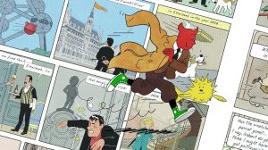

# EuroBSDCon 参会报告

- 原文：[EuroBSDCon Trip Report](https://freebsdfoundation.org/our-work/journal/browser-based-edition/production-deployments/eurobsdcon-trip-report/)
- 作者：**Federico Angelilli**

## 在比利时布鲁塞尔 EuroBSDCon ’26 上演讲（2026 年 9 月）

今年我有幸参加了 FreeBSD 项目的谷歌 Summer of Code（GSoC）。每年夏天，谷歌都会赞助这项活动，为学生配上开源项目的导师。学生参与项目几周（我这边是 12 周），之后获得一笔津贴作为报酬。

我是偶然得知这个机会的。由于我喜欢做底层内核编程，选择 FreeBSD 项目显得很自然。我的提案“FreeBSD 内核的实时补丁（Live-patching）”被接受后，我花了三个月做出该子系统及相关工具的第一个修订版本。我的导师 Bojan Novkovic 和 Mateusz Piotrowski 建议我参加 EuroBSDCon，并邀请我到开发者峰会上展示工作、收集反馈以便改进。

我决定采纳他们的建议。因为还是学生，我向基金会申请了差旅资助，基金会慷慨批准。今年的活动持续五天（9 月 9 日至 13 日）：前两天是 FreeBSD 开发者峰会，一天用于教程，之后是正式会议。场地选在布鲁塞尔这座可爱城市的布鲁塞尔自由大学（VUB）校园，此前我只来过这里一次。往返扎芬特姆的布鲁塞尔机场都很顺利，我找的住处离会场只有 2 公里。

我和开发者峰会的组织者 Benedict Reuschling 确认了演讲时段。出乎意料，我拿到了第一场演讲，在第一天 10:30。结果这反倒成了好事，我得以轻松打破僵局。紧张的几分钟过后，我顺利地讲完了。所幸大家都很友善，提出了有用的反馈和值得思考的问题。我起初很担心资深开发者会不喜欢。我这种想法大概来自其他圈子：在那里，年轻人或外来者的贡献一旦触及关键组件，就会遭到恶评。但在 FreeBSD 社区，我完全没看到这种情况，这一点我很喜欢。相反，我立即得到了好问题和好反馈，就像给“同行”开发者提的那样。例如 markj@ 问，如何把安全公告的补丁作为实时补丁模块来应用，以判断未来能否这样部署。

我的场次结束后，我继续听了当天的其他演讲。我有很多机会结识与会者并与他们交谈：Robert Clausecker、Olivier Certner、Aymeric Wibo、Kyle Evans、Mark Johnston、Kristien Nielsen、Christos Longro、Charlie Li，仅举几例。总体而言，我的实时补丁工作反响相当不错，这很令人鼓舞。

第二天我继续听演讲。我特别喜欢 olce@ 关于调度器改进的那场。我和两位同样年轻的与会者 George（Polarian）和 Goran 聊了不少。我也很高兴在会议上见到另外几位意大利人，比如 Vanja Cvelbar、Toni Tiveron 和 Stefano Marinelli。我和 Eirik Overby 聊得很好，他带了几台老式计算机到会场，其中有一台 486。后来他邀请我和他以及他在 Entersekt 的几位同事共进晚餐。

第三天上午我听了 EuroBhyveCon 的几场演讲，下午参加了 Mateusz 的“Ports 任意% 速通”教程。这一天以一顿美妙的晚餐收尾：Aymeric 为我和其他年轻与会者在当地一家餐厅做了安排。在那里，我还有幸与 Kirk McKusik 和 Eric Allman 共进晚餐。

周六是正式会议的第一天。那天我听了以下演讲：

- 《我那 142 台服务器升上云端的那一夜。字面意义上。》——Stefano Marinelli
- 《面向现代异构系统的运行时重优化》——gnn@
- 《BSD 作为日本全国半导体教育的基础平台》——Hiroki Sato
- 《生产环境中的基本系统软件包：实用概览》——Lukas Engelhardt

当晚的社交活动在城郊的非洲博物馆举行。我们乘坐一辆漂亮的老式有轨电车前往。活动的食物、同伴和场地都让我十分享受。

周日是活动的最后一天，相当忙碌。上午 Pontus Stenetorp 办了个小型抽奖，我最终赢到一套 nRF52 开发套件。那天我参加的场次有：

- 《bhyve 虚拟机管理程序的热插拔历险》——Bojan
- 《用 CHERI 为 BSD 带来内存安全》——Brook Davis
- 《ELKE——加密且可爱的 Kage 环境，基于 FreeBSD》——Vinícius
- 《跟上 Ports 中基于语言的打包系统（尤其是 Python）》——Charlie Li

我还参加了为会议收尾的最后一场活动，其中包括传统的失物拍卖。

最终，我从这次会议中学到了很多，其中不少难以用言语表达。但我要说：这个社区虽然相对较小，却十分珍贵，必须守护下去。对所有的同学，我想说：一定要来参加会议，哪怕你不是 BSD“专家”。我交谈过的每个人都非常友善，乐于帮助你融入社区。

再次感谢 FreeBSD 基金会赞助我参加我的第一次 BSD 会议。——Federico Angelilli

---

**Federico Angelilli** 是意大利学生，正在罗马大学（Sapienza University of Rome）完成计算机工程学士学位。他热衷于操作系统、系统编程和参与开源社区。
