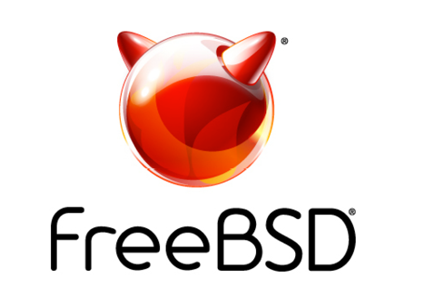
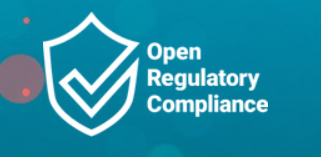
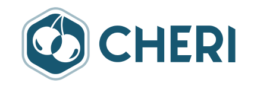

# 活动日历

- 原文：[Q3 Calendar of Events](https://freebsdfoundation.org/our-work/journal/browser-based-edition/production-deployments/q3-calendar-of-events/)
- 作者：**Florine Kamdem**

## 黑客马拉松

2026 年 10 月 27-30 日

挪威奥斯陆

<https://wiki.freebsd.org/Hackathon/202610>

奥斯陆黑客马拉松汇聚 FreeBSD 贡献者，协作推进开源项目，覆盖 FreeBSD 生态的各个领域。与会者可以处理 PR 和代码审查、编写测试、维护 Ports、改进文档，或与志同道合者组队。

Entersekt 将在奥斯陆市中心的办公室主办本次黑客马拉松，时间为 2026 年 10 月 27-30 日，地点在挪威奥斯陆。

## Code & Compliance 2026

2026 年 10 月 27 日

比利时布鲁塞尔

<https://codeandcompliance.orcwg.org/>

Code & Compliance 2026 是面向开源开发者、项目管理者与行业相关方的社区活动，聚焦软件合规、治理与开源安全。活动将于 2026 年 10 月 27 日在比利时布鲁塞尔举行。这次聚会为协作、分享最佳实践、讨论合规挑战提供了平台，也让开源社区有机会增进信任、透明度与长期可持续性。

## 2026 年 11 月 FreeBSD 厂商峰会

2026 年 11 月 5-6 日

美国加利福尼亚州圣何塞（NetApp 圣何塞园区）

<https://freebsdfoundation.org/news-and-events/event-calendar/november-2026-freebsd-vendor-summit/>

这场为期两天的峰会由 NetApp 主办、FreeBSD 基金会赞助，让商业 FreeBSD 用户得以与开发者和贡献者面对面交流，争取想要的功能、解决问题、满足需求。会议将在 FreeBSD Meetings YouTube 频道直播。报名即将开放。

## CHERITech’26

2026 年 11 月 12-13 日

德国慕尼黑

<https://cheri-alliance.org/events/cheritech26/>

本次会议与 SEMICON Europa 同期举办，汇聚研究人员、技术专家、网络安全专家和产品开发者，共同探讨 CHERI 技术与安全计算的进展，重点关注塑造“设计即安全”未来的技术创新。
